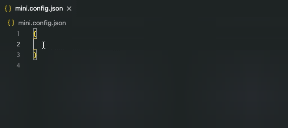

# mini-json-types

阿里小程序(支付宝小程序)`json`配置文件`JSON Schema`和`TypeScript`类型定义，用于`.json`文件校验和自动提示



## JSON Schema

- app.json: https://unpkg.com/mini-json-types/schemas/app.json
- page.json: https://unpkg.com/mini-json-types/schemas/page.json
- component.json: https://unpkg.com/mini-json-types/schemas/component.json
- mini.project.json: https://unpkg.com/mini-json-types/schemas/mini.project.json
- sitemap.json: https://unpkg.com/mini-json-types/schemas/sitemap.json
- rax-app.json: https://unpkg.com/mini-json-types/schemas/rax-app.json

## VSCode 配置

`setting.json`

```json
{
  "json.schemas": [
    { "fileMatch": ["app.json"], "url": "https://unpkg.com/mini-json-types/schemas/app.json" },
    { "fileMatch": ["page.json"], "url": "https://unpkg.com/mini-json-types/schemas/page.json" },
    { "fileMatch": ["component.json"], "url": "https://unpkg.com/mini-json-types/schemas/component.json" },
    { "fileMatch": ["mini.project.json"], "url": "https://unpkg.com/mini-json-types/schemas/mini.project.json" },
    { "fileMatch": ["sitemap.json"], "url": "https://unpkg.com/mini-json-types/schemas/sitemap.json" },
  ]
}
```
